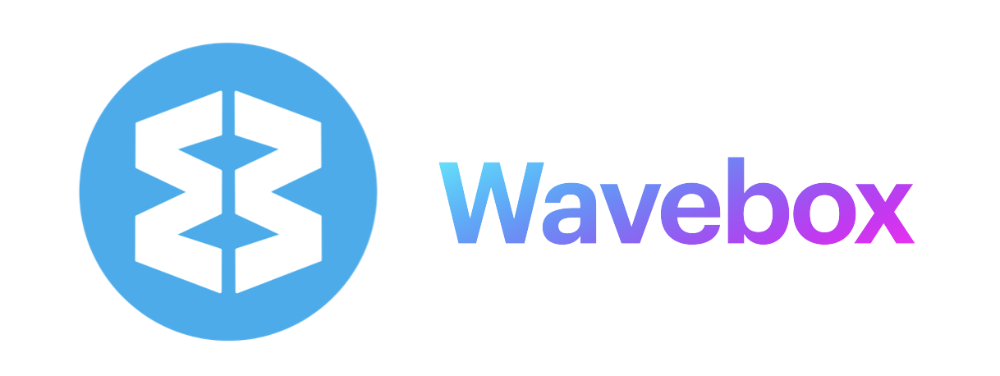
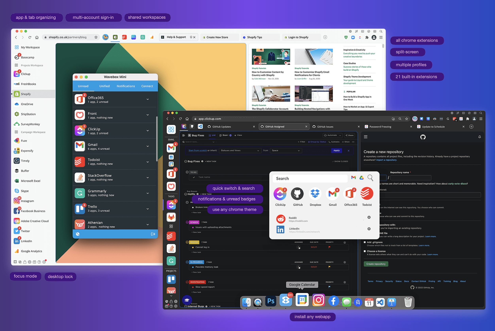

  

  <a href="https://wavebox.io">Website</a>
  ·
  <a href="https://wavebox.io/download">Download</a>
  ·
  <a href="https://wavebox.io/blog">Blog</a>
  ·
  <a href="https://discord.gg/gJJhJMecxk">Discord</a>
  ·
  <a href="https://wavebox.supahub.com">Feature requests</a>

## 🦸 About

This is an issues & release-only repo for Wavebox, the revolutionary and feature-rich Chromium browser that's built for productive working across Google Workspaces, Microsoft Teams, ClickUp, Monday, Atlassian, Asana, AirTable, Slack, and every other web app you use to get work done.

Wavebox gives you customizable toolbars, sleeping tabs, cookie containers and multiple profile

✅ Tab management, organizing, sleep, and search. [More](https://blog.wavebox.io/how-to-keep-tabs-on-your-browser-tabs/).

✅ Multiple [cookie containers](https://blog.wavebox.io/saas-profiles-groups-collections-tutorial/), for multi-account sign-in.

✅ [Multiple profiles](https://kb.wavebox.io/wavebox-profiles/), for multiple setups.

✅ Multiway [split screen](https://kb.wavebox.io/using-split-screen-in-wavebox/).

✅ High performance, longer battery life.

✅ Zero ads or tracking.

✅ Extensions directly from the Chrome Store.

## 💾 Downloads

Wavebox is available for:

* [macOS](https://wavebox.io/download?platform=mac) (Intel & Apple Silicon)
* [Windows](https://wavebox.io/download?platform=windows)
* [Linux](https://wavebox.io/download?platform=linux) (DEB, RPM, TAR, AppImage, AUR)

If you want to try the latest features, and see what's coming soon, Wavebox also has a [beta channel](https://wavebox.io/download/beta)

## 📖 Changelog

Wavebox keeps parity with the latest version of Chromium , which means we tend to have a major release every 4 weeks. You can find information about what's new in each release in our changelog

* [Stable changelog](https://wavebox.io/changelog/stable/)
* [Beta changelog](https://wavebox.io/changelog/beta/)

## 🐛 Issues, Bugs, & Feature Requests

For dedicated support, we recommend reaching out to our support team, either by using the in-app support button, or by visiting the [support page](https://wavebox.io/support).

You can also visit our the [Wavebox knowledge base](https://wavebox.io/kb) which has answers to lots of common problems, or raise an [issue in this repo](https://github.com/wavebox/waveboxapp)

To request a feature or upvote one that's already open use [Wavebox Supahub](https://wavebox.supahub.com)

Want to chat with follow Waveboxers? Then check out our [Discord channel](https://discord.gg/gJJhJMecxk)

## 💻 Developer resources

🏗️ Wavebox supports the same extension ecosystem and set of extension APIs as Chromium & Google Chrome. In addition to this it also provides some additional features over the standard extension APIs. You can find information about these in the [wavebox-10-extension-api](https://github.com/wavebox/wavebox-10-extension-api) repo.

👍 Wavebox is committed to staying up to date with the latest versions of Chromium, and to make it easy to check we launched [Chromium Checker](https://chromiumchecker.com) which not only reads out the UserAgent, but also feature detects the Chromium version. If you want to check how it works, visit the [chromium-checker-site](https://github.com/wavebox/chromium-checker-site) repo

---

#### Wavebox Classic

Wavebox 10, a complete fork of Chromium launched in 2019, but if you're looking for the Electron based Wavebox Classic, there's an [archive of the code here](classic). More info about [our move to Chromium](https://blog.wavebox.io/wavebox-is-evolving-electron-chromium/).
